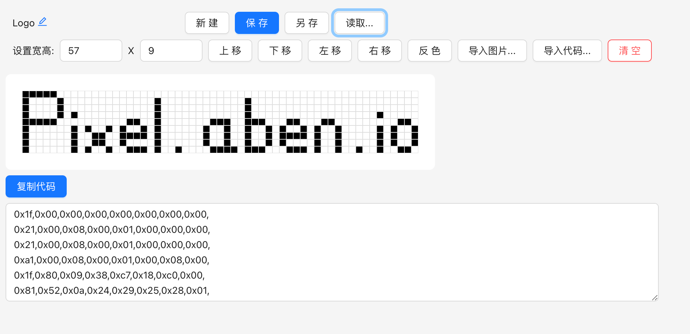
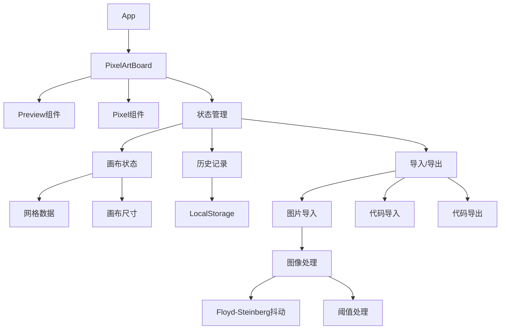

# PixelArtBoard - 像素画板

自己画像素图或者导入图片取模，为 [U8g2](https://github.com/olikraus/u8g2) 提供图片素材.

[在线使用](https://pixel.aben.io/)



## 技术栈

-   React 18
-   TypeScript 4
-   Ant Design 5
-   Day.js
-   UUID
-   AHooks

## 项目架构


```mermaid
graph TD
    A[App] --> B[PixelArtBoard]
    B --> C[Preview组件]
    B --> D[Pixel组件]
    B --> E[状态管理]
    E --> F[画布状态]
    E --> G[历史记录]
    E --> H[导入/导出]

    F --> I[网格数据]
    F --> J[画布尺寸]

    G --> K[LocalStorage]

    H --> L[图片导入]
    H --> M[代码导入]
    H --> N[代码导出]

    L --> O[图像处理]
    O --> P[Floyd-Steinberg抖动]
    O --> Q[阈值处理]
```

## 主要功能介绍

### `新建`

新建一个默认 128x64 的空白文件. 对画布的修改会实时保存在缓冲区, 即使关闭浏览器也可以下次回来继续编辑.

### `保存`

将画布保存。可以在 `读取...` 功能中打开保存的画布列表.

### `另存`

将当前画布另存一个副本.

### `读取...`

读取之前保存的画布列表.

### `导入图片...`

上传一张图片, 裁剪后取模获得像素图. 支持以下功能：

-   图片裁剪
-   Floyd-Steinberg 抖动算法
-   阈值处理
-   RGB 权重调整

### `导入代码...`

首先根据代码设置画布的宽高, 然后导入代码. 支持从 U8g2 代码格式导入.

## 项目特点

1. **本地存储**: 使用 LocalStorage 保存画布状态和历史记录
2. **响应式设计**: 支持自定义画布尺寸
3. **图像优化**: 提供多种图像处理算法
4. **实时预览**: 编辑时可实时预览效果
5. **代码互转**: 支持 U8g2 代码格式的导入导出

## 开发指南

### 环境要求

-   Node.js 16+
-   npm 8+

### 开发模式

在根目录运行命令:

```bash
npm start
```

打开 [http://localhost:3000](http://localhost:3000) 可以使用.

开发模式支持热更新.

### 构建项目

```bash
npm run build
```

生成静态文件并保存在 `build` 目录.

## 贡献指南

1. Fork 本仓库
2. 创建特性分支 (`git checkout -b feature/AmazingFeature`)
3. 提交改动 (`git commit -m 'Add some AmazingFeature'`)
4. 推送到分支 (`git push origin feature/AmazingFeature`)
5. 提交 Pull Request

## 许可证

本项目采用 MIT 许可证 - 详见 LICENSE 文件
