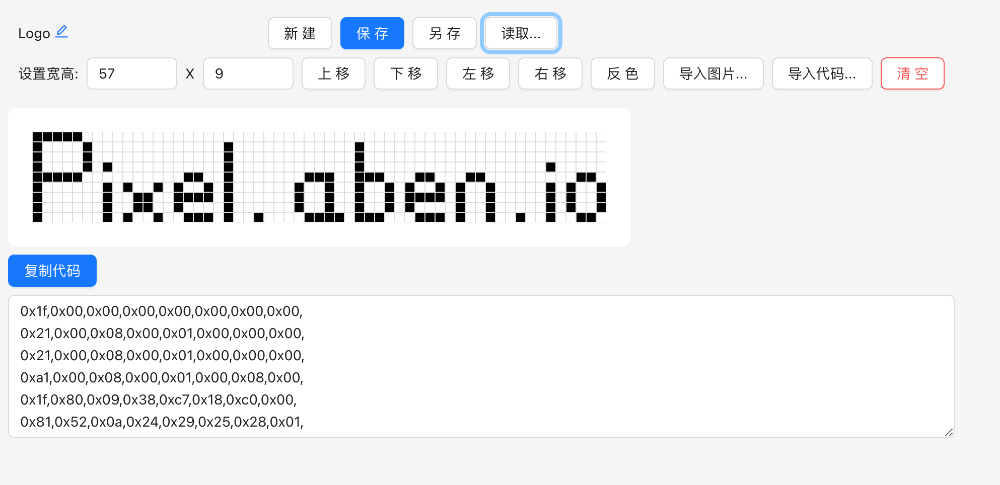

# PixelArtBoard - 像素画板

自己画像素图或者导入图片取模，为 [U8g2](https://github.com/olikraus/u8g2) 提供图片素材.

[在线使用](https://pixel.aben.io/)

## 主要功能介绍

### `新建`

新建一个默认 128x64 的空白文件. 对画布的修改会实时保存在缓冲区, 即使关闭浏览器也可以下次回来继续编辑.

### `保存`

将画布保存。可以在 `读取...` 功能中打开保存的画布列表.

### `另存`

将当前画布另存一个副本.

### `读取...`

读取之前保存的画布列表.

### `导入图片...`

上传一张图片, 裁剪后取模获得像素图.

### `导入代码...`

首先根据代码设置画布的宽高, 然后导入代码.

## 开发模式

在根目录运行命令:

### `npm start`

进入模式。\
打开 [http://localhost:3000](http://localhost:3000) 可以使用.

开发模式支持热更新.

### `npm run build`

生成静态文件并保存在 `build` 目录.
